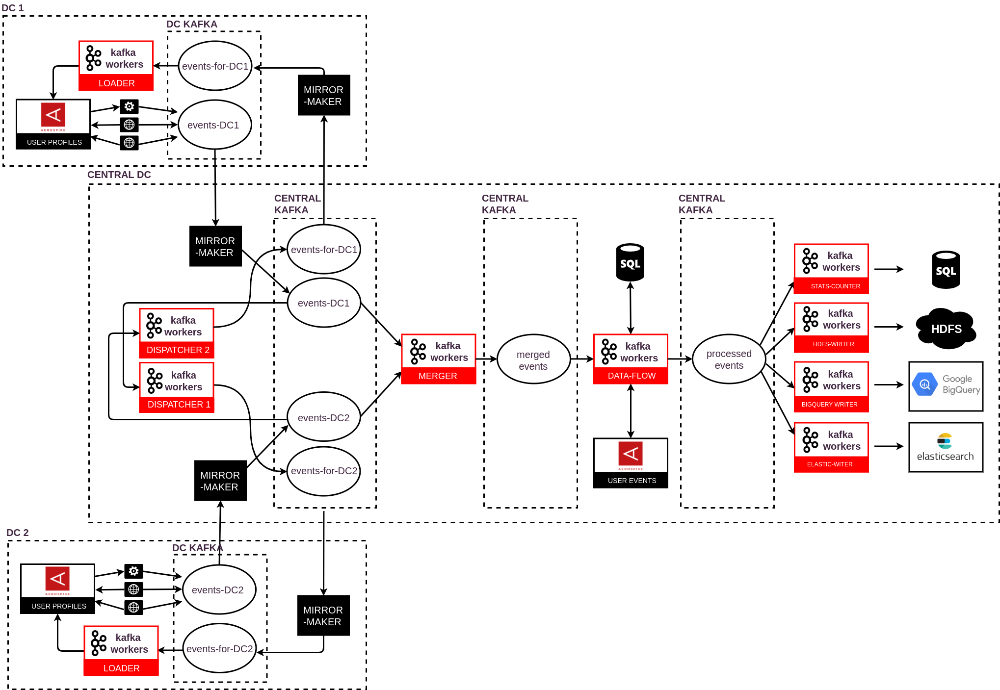

# Kafka Workers

Kafka Workers is a client library which unifies records consuming from Kafka and processing them by user-defined tasks. It provides:
 - higher level of distribution because of sub-partitioning defined by **WorkerPartitioner**,
 - tighter control of offsets commits to Kafka applied by **RecordStatusObserver**,
 - possibility to pause and resume processing by **WorkerTask** for given partition,
 - at-least-once state and output semantics,
 - backpressure,
 - processing timeouts,
 - handling failures.

## Motivation

The major thing to address was a threading model with better resources utilization in terms of:
 - decoupling consumption and processing with records buffering (for better performance)
 - higher level of distribution for processing (higher than consumption and not always limited by partitions count)
 
Especially for the second point we have a repeating scenario: for some reasons we want to keep the same (not too high) count of partitions which gives us a good distribution and efficiency of day-to-day processing. The problem occurs when we need to (re)process the stream with a huge (consumer) lag (for example because of some failure). In such a scenario we would like to temporarily bump up the number of partitions for data stored in Kafka to better utilize cpu and/or external APIs. It is what we called sub-partitioning. What is important in terms of proper distributed processing, stream of records from one TopicPartition could be reordered now but records with the same WorkerSubpartition remain ordered to each other. Assuming that the user-defined subpartitioner depends on the key, these streams remain partially ordered but records with the same keys are processed sequentially.
 
The second requirement was a possibility to pause and resume processing for a given partition. It was required particularly by one of our components which role is to merge given pairs of partitions from different topics. It is a time-aware merging so from time to time we need to "wait" for a related partition without stopping others. What is more, this feature gives backpressure mechanism which was needed by mentioned separation of consumption and processing.
 
The last but not least was simplicity (lightweight library, with almost pure Kafka Consumer-like API, with no processing cluster, without external dependencies, without translating messages to/from its internal data format etc.) and genericity (we managed to replace mix of technologies like Storm, Kafka Streams/Connect, Flume and Logstash by a unified solution).

## Version

Current version is **1.1.6.1-SNAPSHOT**

## Requirements

You need Java 11 and at least Apache Kafka 2.0 to use this library.

## Installation

Releases are distributed on [mvn repository](https://mvnrepository.com/artifact/com.rtbhouse/kafka-workers):

```xml
<dependency>
    <groupId>com.rtbhouse</groupId>
    <artifactId>kafka-workers</artifactId>
    <version>1.1.6.1-SNAPSHOT</version>
</dependency>
```

## Usage

To use Kafka Workers you should implement the following interfaces:

```java
public interface WorkerTask<K, V> {

    void init(WorkerSubpartition subpartition, WorkersConfig config);

    boolean accept(WorkerRecord<K, V> record);

    void process(WorkerRecord<K, V> record, RecordStatusObserver observer);

    void punctuate(long punctuateTime);

    void close();
}
```
User-defined task which is associated with one of WorkerSubpartitions. The most crucial are: accept() and process() methods. The first one checks if given WorkerRecord could be polled from internal WorkerSubpartition's queue peek and passed to process method. The second one processes just polled WorkerRecord from given WorkerSubpartition's internal queue. Processing could be done synchronously or asynchronously but in both cases one of the RecordStatusObserver's methods onSuccess() or onFailure() has to be called. Not calling any of these methods for configurable amount of time will be considered as a failure. Additionally, punctuate() method allows to do maintenance tasks every configurable amount of time independently if there are records to process or not. All the methods: accept(), process() and punctuate() are executed in a single thread sequentially so synchronization is not necessary. What is more, both methods: init() and close() are synchronized with these accept(), process() and punctuate() internally by Kafka Workers so additional user synchronization is not necessary for these calls as well.

```java
public interface WorkerPartitioner<K, V> {

    int subpartition(ConsumerRecord<K, V> consumerRecord);

    int count(TopicPartition topicPartition);
}
```
User-defined partitioner is used for additional sub-partitioning which could give better distribution of processing. It means that stream of records from one TopicPartition could be reordered during processing but records with the same WorkerSubpartition remain ordered to each other. It leads also to a bit more complex offsets committing policy which is provided by Kafka Workers to ensure at-least-once delivery.

Usage example:
```java

    Properties properties = new Properties();
    properties.setProperty("consumer.topics", "my-topic");
    properties.setProperty("consumer.kafka.bootstrap.servers", "localhost:9192");
    properties.setProperty("consumer.kafka.group.id", "my-workers");
    properties.setProperty("consumer.kafka.key.deserializer", "org.apache.kafka.common.serialization.BytesDeserializer");
    properties.setProperty("consumer.kafka.value.deserializer", "org.apache.kafka.common.serialization.BytesDeserializer");

    KafkaWorkers<String, String> kafkaWorkers = new KafkaWorkers<>(
        new WorkersConfig(properties),
        new MyWorkerTaskFactory<>(),
        new MyWorkerPartitioner<>(),
        new MyShutdownCallback());

    Runtime.getRuntime().addShutdownHook(new Thread(kafkaWorkers::shutdown));
    kafkaWorkers.start();
    KafkaWorkers.Status status = kafkaWorkers.waitForShutdown();
 }
```

## Internals

Internally one Kafka Workers instance launches one consumer thread, one punctuator thread and configurable count of worker threads. Each thread can execute one or more WorkerTasks and each WorkerTask processes WorkerRecords from internal queue associated with given WorkerSubpartition. Kafka Workers ensures by its offsets state that only continuously processed offsets are commited. 


## Configuration

<table class="data-table"><tbody>
<tr>
   <th>Name</th>
   <th>Description</th>
   <th>Type</th>
   <th>Default</th>
</tr>
<tr>
   <td>consumer.topics</td>
   </td>
   <td>A list of kafka topics read by ConsumerThread.</td>
   </td>
   <td>list</td>
   </td>
   <td></td>
</tr>
<tr>
   <td>consumer.commit.interval.ms</td>
   </td>
   <td>The frequency in milliseconds that the processed offsets are committed to Kafka.</td>
   </td>
   <td>long</td>
   </td>
   <td>10000</td>
   </td>
</tr>
<tr>
   <td>consumer.processing.timeout.ms</td>
   </td>
   <td>The timeout in milliseconds for record to be successfully processed.</td>
   </td>
   <td>long</td>
   </td>
   <td>300000</td>
   </td>
</tr>
<tr>
   <td>consumer.poll.timeout.ms</td>
   </td>
   <td>The time in milliseconds spent waiting in poll if data is not available in the buffer. If 0, returns immediately with any records that are available currently in the buffer, else returns empty.</td>
   </td>
   <td>long</td>
   </td>
   <td>1000</td>
   </td>
</tr>
<tr>
   <td>consumer.commit.retries</td>
   </td>
   <td>The number of retries in case of retriable commit failed exception.</td>
   </td>
   <td>int</td>
   </td>
   <td>3</td>
   </td>
</tr>
<tr>
   <td>consumer.kafka</td>
   </td>
   <td>Should be used as a prefix for internal kafka consumer configuration. Usage example:

    consumer.kafka.bootstrap.servers = localhost:9192
    consumer.kafka.group.id = my-workers
    consumer.kafka.key.deserializer = org.apache.kafka.common.serialization.BytesDeserializer
    consumer.kafka.value.deserializer = org.apache.kafka.common.serialization.BytesDeserializer
   </td>
   </td>
   <td></td>
   </td>
   <td></td>
</tr>
<tr>
   <td>worker.threads.num</td>
   </td>
   <td>The number of WorkerThreads per one Kafka Workers instance.</td>
   </td>
   <td>int</td>
   </td>
   <td>1</td>
   </td>
</tr>
<tr>
   <td>worker.sleep.ms</td>
   </td>
   <td>The time in milliseconds to wait for WorkerThread in case of not accepted tasks.</td>
   </td>
   <td>long</td>
   </td>
   <td>1000</td>
   </td>
</tr>
<tr>
   <td>worker.processing.guarantee</td>
   </td>
   <td>Specifies worker processing guarantees. Possible values:
    <ul>
        <li><code>none</code> - logs and skips records which cause processing failure, thus failures don't cause message retransmission and may result in data loss.</li>
        <li><code>at_least_once</code> - shuts Kafka Workers down on record processing failure, enforces message retransmission upon restart and may cause data duplication.</li>
    </ul>
   </td>
   <td>String</td>
   </td>
   <td><code>at_least_once</code></td>
</tr>
<tr>
   <td>worker.task</td>
   </td>
   <td>Could be used as a prefix for internal task configuration.
   </td>
   </td>
   <td></td>
   </td>
   <td></td>
</tr>
<tr>
   <td>punctuator.interval.ms</td>
   </td>
   <td>The frequency in milliseconds that punctuate method is called.</td>
   </td>
   <td>long</td>
   </td>
   <td>1000</td>
   </td>
</tr>
<tr>
   <td>queue.total.size.heap.ratio</td>
   </td>
   <td>
     It defines how big part of the heap can be used for input queues (0.5 size of the heap by default).
     This total memory size for all queues is divided into individual queue sizes. E.g. for 8G heap and 0.5 ratio
     there will be 4G for all queues. If there are 32 subpartitions each of them will get 128M input queue.
     Input record sizes are calculated using <code>record.key.weigher</code> and <code>record.value.weigher</code>
     classes. 
   </td>
   </td>
   <td>double from (0, 1) range</td>
   </td>
   <td>0.5</td>
   </td>
</tr>
<tr>
   <td>record.key.weigher</td>
   </td>
   <td>
     Class implementing <code>com.rtbhouse.kafka.workers.api.record.weigher.Weigher</code> interface
     which measures size in bytes of input record keys. It is used to compute the total size of input records
     and input queues.
   </td>
   </td>
   <td>class</td>
   </td>
   <td></td>
   </td>
</tr>
<tr>
   <td>record.value.weigher</td>
   </td>
   <td>
     Class implementing <code>com.rtbhouse.kafka.workers.api.record.weigher.Weigher</code> interface
     which measures size in bytes of input record values. It is used to compute the total size of input records
     and input queues.
   </td>
   </td>
   <td>class</td>
   </td>
   <td></td>
   </td>
</tr>
<tr>
   <td>queue.resume.ratio</td>
   </td>
   <td>The minimum ratio of used to total queue size for partition resuming.</td>
   </td>
   <td>double</td>
   </td>
   <td>0.9</td>
   </td>
</tr>
<tr>
   <td>metric.reporters</td>
   </td>
   <td>A list of classes to use as metrics reporters. Implementing the <code>org.apache.kafka.common.metrics.MetricsReporter</code> interface allows plugging in classes that will be notified of new metric creation. The JmxReporter is always included to register JMX statistics.</td>
   </td>
   <td>list</td>
   </td>
   <td>""</td>
   </td>
</tr>
</tbody></table>

## Use cases

At RTB House we use Kafka Workers for all components in our processing infrastructure. For more details please check out our techblog posts:
 - [Our real-time data processing - part 1](https://techblog.rtbhouse.com/2017/06/15/data-flow-part1)
 - [Our real-time data processing - part 2](https://techblog.rtbhouse.com/2018/12/10/data-flow-part2)
 - [Kafka Workers as an alternative to Kafka Connect](https://techblog.rtbhouse.com/2020/03/31/kafka-workers-vs-connect/)

We have adopted Kafka Workers to all our use cases which are: Kafka-to-Kafka-processing and HDFS, BigQuery, Aerospike, Elastic streaming etc. It helps us to utilize different types of resources and works successfully on a really huge scale. So far we have open sourced a core part only but we are going to do the same with our "connectors". The diagram below shows high-level architecture of our current processing infrastructure:



